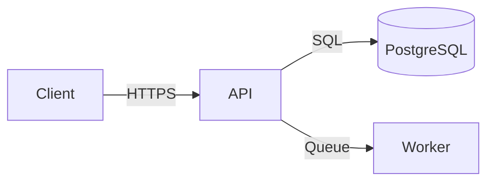

# Technical Specification: [Feature / System Name]

## 1. Overview

**Explain what is being built, why it matters, and what is out of scope.**

### 1.1 Purpose

[1–2 sentences: what this spec defines and why]

### 1.2 Background

[2–4 paragraphs: the problem, why now, what's been tried before. Link to relevant PRD or research.]

### 1.3 Roles & Responsibilities

| Role / Team | Responsibility | Decision Area |
| ----------- | -------------- | ------------- |

### 1.4 Customer & Business Context

[Summarize the customer need, business case, personas, and success definition. Link to PRD when available; mark inferred context with `[assumed]`.]

### 1.5 Goals

| Goal | Success Metric | Target |
| ---- | -------------- | ------ |

### 1.6 Non-Goals

- **Excluded:** [Explicitly out of scope]

---

## 2. Functional Requirements

**Describe user-facing and system behavior in testable terms.**

### 2.1 Actors

| Actor | Description |
| ----- | ----------- |

### 2.2 User Flows

**Flow: [Flow Name]**

1. [Step 1]
2. [Step 2]
3. [Step 3 with decision: if X then Y, else Z]

### 2.3 Functional Requirements

#### FR-001: [Requirement Title]

**Priority:** Must-have / Should-have / Could-have
**Actor:** [Who triggers this]
**Description:** [Precise, testable statement — "The system shall…"]
**Acceptance criteria:**

- [ ] **Criterion:** [Testable criterion]

### 2.4 Business Rules

- **BR-001:** [Rule — e.g., "A user may not have more than 3 active sessions"]

---

## 3. Non-Functional Requirements

**Set measurable quality targets for the system.**

| Category | Requirement | Target | Priority |
| ------------ | ----------------------- | --------------- | -------- |
| Performance | API response time (p95) | < 200ms | High |
| Availability | Uptime SLA | 99.9% | High |
| Scalability | Concurrent users | 10,000 | Medium |
| Security | Auth mechanism | JWT, 15-min TTL | High |

---

## 4. System Architecture

**Describe the high-level design and responsibilities.**

### 4.1 Architecture Overview

[2–3 paragraphs describing the high-level approach and key decisions]



### 4.2 Component Responsibilities

| Component | Technology | Responsibility |
| --------- | ---------- | -------------- |

### 4.3 Key Design Decisions

**Decision: [Title]**

- **Chosen:** [What]
- **Rationale:** [Why]
- **Trade-off:** [What was sacrificed]

---

## 5. API Design

**Define new or changed service contracts.**

### 5.1 New Endpoints

#### `[METHOD] [/path]`

**Purpose:** [One sentence]
**Auth:** Required / None

**Request:**

```json
{ "field": "type" }
```

**Response (200):**

```json
{ "id": "string", "result": "value" }
```

**Errors:**

| Status | Condition |
| ------ | --------- |

### 5.2 Modified Endpoints

[List endpoints with changes and migration notes]

---

## 6. Data Model

**Specify persistence changes and migration needs.**

### 6.1 New Tables / Collections

```sql
CREATE TABLE [table_name] (
  id         UUID PRIMARY KEY DEFAULT gen_random_uuid(),
  [field]    [TYPE] NOT NULL,
  created_at TIMESTAMPTZ NOT NULL DEFAULT now(),
  updated_at TIMESTAMPTZ NOT NULL DEFAULT now()
);
```

### 6.2 Schema Changes

[Existing tables being modified]

### 6.3 Migration Plan

[How to migrate from current state to new schema]

---

## 7. Security Considerations

**Document authentication, authorization, and protection requirements.**

- **Authentication:** [Mechanism]
- **Authorization:** [RBAC rules]
- **Data protection:** [Encryption, PII handling]
- **Rate limiting:** [Thresholds]
- **Audit logging:** [What is logged and where]

---

## 8. Observability

**Define signals needed to operate and debug the system.**

| Signal | What to instrument | Tooling |
| ------- | ----------------------------------- | ------- |
| Metrics | [request rate, error rate, latency] | |
| Logs | [request, errors, audit events] | |
| Traces | [which services] | |
| Alerts | [key conditions] | |

---

## 9. Testing Strategy

**Map implementation risk to verification coverage.**

| Level | Scope | Tools | Coverage Target |
| ----------- | ------------------- | ----- | ------------------------ |
| Unit | Business logic | | ≥ 85% |
| Integration | Service + DB | | Key flows |
| E2E | Critical user paths | | Happy path + main errors |

### 9.1 Data, Privacy, and Compliance Verification

[How personal information, auditability, retention, permissions, and compliance-sensitive behavior will be tested.]

---

## 10. Implementation Plan

**Break delivery into phases and dependencies.**

### Phase 1: [Name] (Est: [N] days)

- [ ] **Task:** [Task]

### Dependencies

| Dependency | Team / System | Needed by |
| ---------- | ------------- | --------- |

## 11. Release & Operational Readiness

**List launch prerequisites and ownership.**

| Activity | Owner | Required Before Launch |
| -------- | ----- | ---------------------- |
| Rollout / feature flag plan | | |
| Support training | | |
| User documentation | | |
| Monitoring and alerts | | |
| Feedback collection | | |

---

## 12. Open Questions

**Track unresolved decisions before handoff.**

| # | Question | Owner | Due | Status |
| --- | -------- | ----- | --- | ------ |

---

## 13. Appendix

**Collect supporting links and definitions.**

- **Supporting material:** [Glossary, links to related specs, ADRs, designs]
