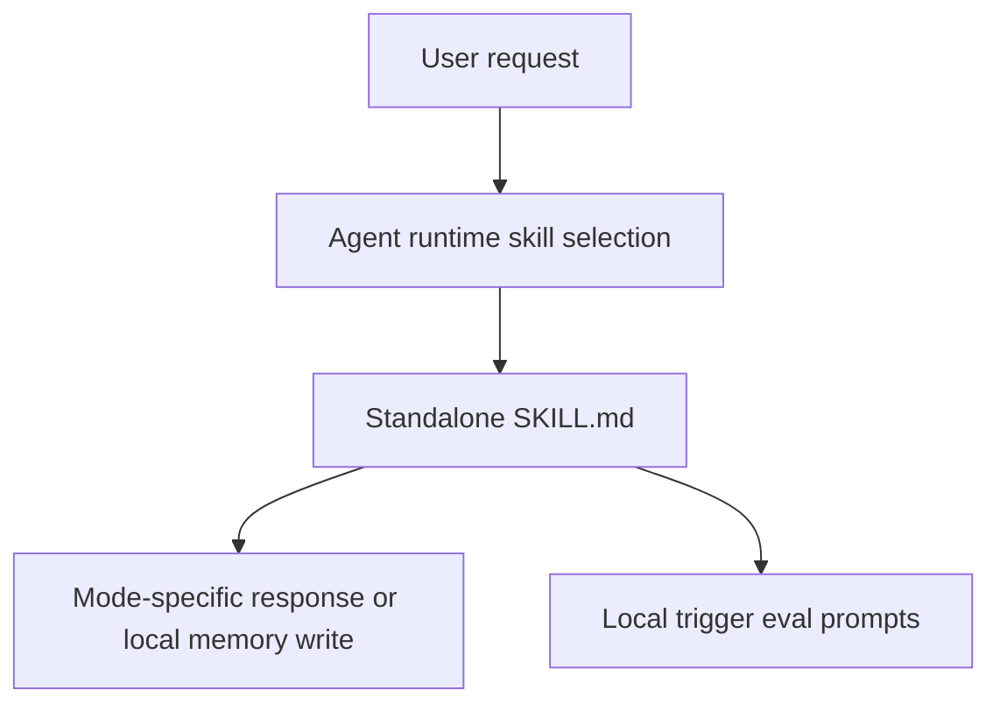

# Technical Specification: General Agent Skills

## Document Info

**Status:** Approved  
**Version:** 1.0  
**Date:** 2026-05-21  
**Author:** Oleg Shulyakov  
**Reviewer:** TBD  
**Target release:** TBD  
**Source PRD:** [PRD.md](PRD.md)

---

## 1. Overview

### 1.1 Purpose

This spec defines the implementation contract for nine standalone, general-purpose agent skills: `ask`, `explain`, `reason`, `classify`, `plan`, `explore`, `decide`, `coordinate`, and `remember`.

The goal is to make common collaboration modes predictable at runtime without requiring any skill to depend on another installed skill.

### 1.2 Background

The existing skill library covers specialized creation, coding, review, documentation, and operations workflows. It has a remaining gap for project-agnostic thinking modes that recur across repositories and tasks.

Without explicit skills for these modes, the agent must infer broad behavior from generic instructions each time. That creates inconsistent trigger behavior, unclear output shapes, and accidental overlap between similar modes such as `plan` and `coordinate`, or `ask` and `reason`.

This work creates a small general layer with clear trigger boundaries, exclusions, expected behavior, and eval prompts for each skill.

### 1.3 Roles & Responsibilities

| Role / Team | Responsibility | Decision Area |
| --- | --- | --- |
| Owner | Oleg Shulyakov | Final scope, naming, acceptance, and release readiness |
| Skill library maintainer | Implement skill folders, metadata, references, and evals | File layout, authoring quality, validation |
| Reviewer | Review trigger boundaries, overlap, and behavior coverage | Approval or required changes |
| Users | Exercise skills through natural requests | Feedback on usefulness and trigger accuracy |

### 1.4 Customer & Business Context

The primary users are individual developers, maintainers, and project leads who want consistent collaboration behavior for asking, explaining, reasoning, classifying, planning, exploring local context, deciding, coordinating, and remembering.

Success means a user can install any one of the nine skills independently and get useful behavior for that mode without hidden runtime coupling.

### 1.5 Goals

| Goal | Success Metric | Target |
| --- | --- | --- |
| Minimal general skill set | Nine skills exist with approved names | `ask`, `explain`, `reason`, `classify`, `plan`, `explore`, `decide`, `coordinate`, `remember` |
| Standalone runtime behavior | No skill requires another skill to be installed, named, or delegated to | 100% of skills |
| Predictable triggers | Each skill documents triggers, exclusions, expected behavior, and eval prompts | 8-10 eval prompts where possible, never fewer than 7 |
| Lightweight packaging | Main `SKILL.md` files remain concise | Under 500 lines each |

### 1.6 Non-Goals

This work does not add live integrations with Jira, Linear, Confluence, GitHub Issues, or external memory stores. It does not add web search behavior to `explore`, automatic memory writes without durable value, a shared trigger-overlap eval harness, or replacements for project-level `AGENTS.md` instructions.

---

## 2. Functional Requirements

### 2.1 Actors

| Actor | Description |
| --- | --- |
| End user | Invokes a skill through natural language requests |
| Agent runtime | Selects and executes skills based on metadata and user intent |
| Skill maintainer | Creates, reviews, validates, and packages skills |
| Reviewer | Checks behavior, trigger overlap, portability, and eval coverage |

### 2.2 Skill File Layout

Each skill shall live in its own folder under `.agents/skills/<skill-name>/`.

Each skill folder shall include:

```text
.agents/skills/<skill-name>/
├── SKILL.md
└── evals/
    └── evals.json
```

Evaluation run results, when generated, shall be stored under `evals/iterations/iteration-N/` according to the `creator-skill` workflow. A `references/` folder may be added only when it contains useful supporting files, such as examples, detailed procedures, or compatibility notes that would make `SKILL.md` too long or less readable. Do not create placeholder `references/` folders.

### 2.3 Skill Metadata Contract

Each `SKILL.md` shall include frontmatter with `name`, `description`, `license`, `version`, `tags`, `author`, and `metadata`.

The `description` shall explicitly include the strongest trigger phrases and contexts for that skill. It shall not rely on body text alone for runtime discoverability.

Allowed frontmatter fields are:

| Field | Required | Description |
| --- | --- | --- |
| `name` | Yes | A unique identifier for the skill. |
| `description` | Yes | A concise explanation of the skill's purpose and when to use it. |
| `license` | No | The name of the license, such as `MIT` or `Apache-2.0`. |
| `version` | No | Semantic versioning string, such as `1.2.0`. |
| `tags` | No | A list of categories for easier discovery and filtering. |
| `author` | No | The creator's name or GitHub profile URL. |
| `metadata` | No | A nested mapping for arbitrary key-value pairs. |

Each skill body shall define purpose, scope, trigger cases, non-trigger cases, workflow, output expectations, error paths, and verification guidance where relevant.

### 2.4 Per-Skill Behavior Requirements

#### FR-001: `ask`

**Priority:** Must-have  
**Description:** The system shall use `ask` for question generation, clarification, missing-context discovery, and assumption surfacing.

**Acceptance criteria:**

- [ ] Triggers on "ask", "what should I ask", "right questions", "what are we missing", "clarify this", and ambiguous requests blocked by missing context.
- [ ] Produces a minimal prioritized set of high-leverage questions.
- [ ] States assumptions and context gaps when useful.
- [ ] Avoids exhaustive questionnaires unless explicitly requested.
- [ ] Does not make decisions, plans, or implementation changes as its primary output.

#### FR-002: `explain`

**Priority:** Must-have  
**Description:** The system shall use `explain` for teaching, clarification, walkthroughs, concepts, code behavior, architecture, tradeoffs, and decisions.

**Acceptance criteria:**

- [ ] Triggers on "explain", "what is", "why", "how does", "walk me through", and direct explanation requests.
- [ ] Matches depth to the user's question and available context.
- [ ] For code explanations, inspects relevant local files before describing repository behavior.
- [ ] Marks uncertainty when evidence is incomplete.
- [ ] Does not implement, review, or plan unless the user asks for that additional work.

#### FR-003: `reason`

**Priority:** Must-have  
**Description:** The system shall use `reason` to work through ambiguous problems before a firm output shape, decision, or plan is warranted.

**Acceptance criteria:**

- [ ] Triggers on "reason through", "think through", "brainstorm", "tackle this problem", "help me frame this", "let's work through this", and messy problem statements.
- [ ] Clarifies terms, assumptions, constraints, interpretations, hypotheses, and candidate directions.
- [ ] Avoids forcing a premature recommendation or step-by-step plan.
- [ ] Ends with a clearer framing or next clarity step.
- [ ] Distinguishes facts, assumptions, and opinions.

#### FR-004: `classify`

**Priority:** Must-have  
**Description:** The system shall use `classify` to organize material into meaningful groups.

**Acceptance criteria:**

- [ ] Triggers on "classify", "categorize", "group", "cluster", "sort", "taxonomy", "organize these", and requests to group by explicit criteria.
- [ ] States grouping criteria before or alongside the classification.
- [ ] Labels groups clearly and places items into them.
- [ ] Preserves ambiguous, multi-fit, or unclassified items instead of forcing false precision.
- [ ] Supports grouping by similarity, difference, category, priority, dependency, abstraction level, or user-provided criteria.

#### FR-005: `plan`

**Priority:** Must-have  
**Description:** The system shall use `plan` to sequence work before execution.

**Acceptance criteria:**

- [ ] Triggers on "plan", "break this down", "roadmap", "approach", "milestones", and "how should we proceed".
- [ ] Produces scoped steps, milestones, dependencies, assumptions, risks, and verification strategy when relevant.
- [ ] Defaults to conversational planning unless durable files are explicitly requested or the task clearly needs them.
- [ ] Does not coordinate live owners, blockers, handoffs, or active workstreams as its primary behavior.
- [ ] Identifies when more context is required before a reliable plan can be made.

#### FR-006: `explore`

**Priority:** Must-have  
**Description:** The system shall use `explore` for local repository, local document, and attached-artifact investigation.

**Acceptance criteria:**

- [ ] Triggers on "explore", "investigate", "find where", "understand this repo", "trace", and local-context research requests.
- [ ] Searches local files, project docs, attached artifacts, and repository context only.
- [ ] Uses file references, artifact references, and command evidence for findings.
- [ ] Distinguishes verified facts from inference.
- [ ] Does not perform web search or browsing as part of this skill.

#### FR-007: `decide`

**Priority:** Must-have  
**Description:** The system shall use `decide` to compare options and recommend a direction.

**Acceptance criteria:**

- [ ] Triggers on "decide", "choose", "which option", "tradeoffs", "recommend", and "should we".
- [ ] States decision criteria before or alongside the comparison.
- [ ] Compares viable options against the criteria.
- [ ] Recommends one option when evidence supports a recommendation.
- [ ] Notes assumptions, risks, tradeoffs, and reversibility.

#### FR-008: `coordinate`

**Priority:** Must-have  
**Description:** The system shall use `coordinate` to manage active work across people, agents, tasks, dependencies, blockers, and handoffs.

**Acceptance criteria:**

- [ ] Triggers on "coordinate", "manage this work", "team lead", "lead this", "assign", "delegate", "track blockers", "status", "handoff", and multi-agent or multi-workstream requests.
- [ ] Maintains an execution view with goals, owners, dependencies, current status, blockers, and next actions.
- [ ] Separates active coordination from pre-execution planning.
- [ ] Makes handoff state clear enough for another human or agent to continue.
- [ ] Does not silently assign real people to work without user-provided ownership or clear assumptions.

#### FR-009: `remember`

**Priority:** Must-have  
**Description:** The system shall use `remember` to preserve durable project facts, decisions, and useful observations in `.agents/memory/`.

**Acceptance criteria:**

- [ ] Triggers when the user asks to remember, save context, record a decision, update memory, or preserve a project fact.
- [ ] Treats explicit user requests to remember as approval to write memory without asking again.
- [ ] Writes only durable facts, decisions, and observations with project value.
- [ ] Avoids storing transient task chatter, sensitive information, or unverifiable assumptions as fact.
- [ ] Follows existing `.agents/memory/MEMORY.md` and dated memory file conventions.

#### FR-010: Standalone Runtime Boundaries

**Priority:** Must-have  
**Description:** Each skill shall define complete runtime behavior without requiring another skill.

**Acceptance criteria:**

- [ ] No `SKILL.md` says the runtime must use, call, import, or delegate to another skill.
- [ ] Any development-time references to authoring or validation workflows are clearly not runtime dependencies.
- [ ] Shared concepts may be repeated where needed to preserve standalone behavior.

#### FR-011: Behavior Evals

**Priority:** Should-have  
**Description:** Each skill shall include representative eval prompts for trigger behavior.

**Acceptance criteria:**

- [ ] Each skill has `evals/evals.json` generated through `.agents/skills/creator-skill/`.
- [ ] Each skill has 8-10 realistic eval prompts where possible, and never fewer than the PRD minimum of 7.
- [ ] Each eval set includes at least 3 true-positive prompts.
- [ ] Each eval set includes at least 2 false-positive prompts where nearby language should route elsewhere or not trigger.
- [ ] Each eval set includes at least 2 non-trigger prompts.
- [ ] Each eval prompt states expected trigger behavior and expected output behavior.

### 2.5 Business Rules

**BR-001:** Skill names are fixed as `ask`, `explain`, `reason`, `classify`, `plan`, `explore`, `decide`, `coordinate`, and `remember`.

**BR-002:** Runtime behavior must be standalone. Development-time validation may use existing creator or packaging workflows, but installed skill behavior must not depend on them.

**BR-003:** `explore` is local-only. Web search, browsing, and current-information research are out of scope.

**BR-004:** `remember` may write memory automatically only when the user explicitly asks to remember or preserve something.

**BR-005:** Durable task documentation belongs under `docs/`; durable memory facts and small implementation notes belong under `.agents/memory/`.

---

## 3. Non-Functional Requirements

| Category | Requirement | Target | Priority |
| --- | --- | --- | --- |
| Maintainability | Each skill has one clear workflow and avoids becoming a generic behavior dump | Reviewer can summarize each skill in one sentence | High |
| Portability | Skills work across repositories without assuming this repo layout, except `remember` memory conventions | No hard dependency on project-specific files outside documented exceptions | High |
| Token efficiency | Main skill files stay concise | Under 500 lines per `SKILL.md` | High |
| Trigger accuracy | Trigger and exclusion rules are explicit | Evals include positive, false-positive, and non-trigger prompts | High |
| Source discipline | `explore` cites local evidence and marks inference | Findings include file/artifact references when available | High |
| Memory hygiene | `remember` stores only durable value | No transient chatter or sensitive data in memory notes | High |
| Coordination clarity | `coordinate` preserves execution state | Goals, owners, status, blockers, dependencies, and next actions are explicit | Medium |

---

## 4. System Architecture

### 4.1 Architecture Overview

The feature is a documentation and skill-content addition to the existing local skill library. There are no backend services, APIs, databases, queues, or external integrations.

Each skill is packaged as an independent folder with a `SKILL.md` entry point. Optional supporting files stay inside the same skill folder so each unit remains installable and understandable by itself.



### 4.2 Component Responsibilities

| Component | Responsibility |
| --- | --- |
| `.agents/skills/<skill>/SKILL.md` | Runtime instructions, metadata, trigger guidance, exclusions, workflow, and output expectations |
| `.agents/skills/<skill>/evals/evals.json` | Representative trigger and non-trigger prompts generated through `creator-skill` |
| `.agents/skills/<skill>/evals/iterations/iteration-N/` | Reproducible eval run outputs, grading, and benchmark artifacts when generated |
| `.agents/memory/` | Target memory location for `remember` behavior |
| `.agents/skills/creator-skill/` | Development-time eval generation, validation, and packaging support |

### 4.3 Key Design Decisions

**Decision: Use simple cognitive-mode names.**  
Chosen names are short and direct because the PRD resolved naming in favor of standalone cognitive modes. The tradeoff is that trigger boundaries must be especially explicit to avoid overlap.

**Decision: Keep `explore` local-only.**  
This prevents accidental current-information research and keeps the skill portable across disconnected or restricted environments. The tradeoff is that users must invoke another workflow for web research.

**Decision: Treat explicit remember requests as approval.**  
This removes a redundant confirmation step when the user has already asked to remember something. The tradeoff is that the skill must filter carefully for durability and sensitivity before writing.

**Decision: Store eval prompts per skill.**  
Per-skill eval files keep each installable unit self-contained. A shared overlap harness remains future work.

---

## 5. Data Model

No database or structured runtime data model is added.

The only persistent output introduced by skill behavior is `remember` writing Markdown entries under `.agents/memory/` according to existing conventions.

Memory entries shall use one of these categories when applicable: facts, preferences, decisions, or observations. Decision entries should include context, decision, and revisit conditions when those details are available.

---

## 6. Security, Privacy, and Safety

Skills shall not request, store, or expose secrets. `remember` shall avoid writing credentials, tokens, private personal information, transient task chatter, or unverifiable assumptions as fact.

`explore` shall not use web browsing, web search, external services, or live integrations. Its findings shall be based on local repository files, local docs, attached artifacts, or clearly marked inference.

Skills shall avoid presenting subjective recommendations as facts. `reason` and `decide` shall distinguish assumptions, evidence, opinion, and uncertainty.

---

## 7. Error Paths and Edge Cases

If a user request matches multiple skills, the selected skill shall explain the dominant intent through its output shape, not through a long routing discussion. For example, "Should we plan this migration or split it?" should favor `decide` if the user needs a choice, and `plan` if the choice is already settled.

If required local evidence is missing, `explore` and `explain` shall report what was inspected, what could not be verified, and the best-supported inference.

If `remember` receives content that is explicit but not durable, sensitive, or unverifiable, it shall decline the memory write briefly and explain the reason.

If `coordinate` lacks owners, it shall use unassigned workstreams or assumed role labels instead of inventing real ownership.

If `classify` receives items that do not fit a single category, it shall use an ambiguous, multi-label, or needs-review grouping rather than forcing a clean bucket.

---

## 8. Testing Strategy

### 8.1 Static Review

Review every `SKILL.md` for frontmatter completeness, trigger specificity, exclusions, standalone behavior, output shape, line count, and absence of runtime dependency on another skill.

### 8.2 Trigger Eval Review

For each skill, generate and review `evals/evals.json` through `.agents/skills/creator-skill/`. Use 8-10 realistic prompts where possible, and never fewer than the PRD minimum of 7:

```text
3 true-positive prompts
2 false-positive prompts
2 non-trigger prompts
```

Each prompt shall include the expected trigger result and the expected behavior shape. Eval run outputs, grading, and benchmark summaries shall be stored under `evals/iterations/iteration-N/` when execution runs are performed.

### 8.3 Boundary Testing

Boundary prompts shall specifically test likely overlaps:

| Boundary | Expected Distinction |
| --- | --- |
| `ask` vs `reason` | `ask` produces questions; `reason` develops framing and hypotheses |
| `reason` vs `decide` | `reason` clarifies ambiguity; `decide` recommends between options |
| `plan` vs `coordinate` | `plan` sequences future work; `coordinate` tracks active workstreams and handoffs |
| `explain` vs `explore` | `explain` teaches; `explore` investigates local evidence |
| `classify` vs `decide` | `classify` groups material; `decide` chooses a direction |
| `remember` vs docs writing | `remember` captures durable memory; docs writing creates formal project artifacts |

### 8.4 Manual Acceptance

Manual acceptance passes when a reviewer can invoke representative prompts and observe behavior that matches the spec without needing another skill installed.

---

## 9. Implementation Plan

### Phase 1: Skill Boundaries

- [ ] Draft `SKILL.md` for `ask`, `reason`, `classify`, `plan`, `explore`, `decide`, `coordinate`, and `remember`.
- [x] Treat existing `explain` as complete for this work.
- [ ] Confirm each skill has clear trigger and non-trigger rules.

### Phase 2: Evals

- [ ] Generate evals through `.agents/skills/creator-skill/`.
- [ ] Add generated evals for each skill.
- [ ] Include true-positive, false-positive, and non-trigger prompts.
- [ ] Add boundary prompts for common overlaps.

### Phase 3: Validation

- [ ] Run available skill validation checks.
- [ ] Review line counts and metadata.
- [ ] Check for runtime dependency language between skills.
- [ ] Resolve overlap issues found during review.

### Phase 4: Release Readiness

- [ ] Update `.agents/skills/README.md` if it indexes maintained skills.
- [ ] Update project memory or docs only when durable decisions change.
- [ ] Prepare reviewer handoff with changed files and validation results.

### Dependencies

| Dependency | Needed By |
| --- | --- |
| Existing skill authoring conventions | All skill files |
| Existing `.agents/memory/` conventions | `remember` |
| `.agents/skills/creator-skill/` eval generation workflow | Evals and release readiness |

---

## 10. Release & Operational Readiness

| Activity | Owner | Required Before Launch |
| --- | --- | --- |
| Skill file review | Skill library maintainer | Yes |
| Trigger eval review | Reviewer | Yes |
| README index update | Skill library maintainer | Yes, if README indexes skills |
| Memory behavior spot-check | Reviewer | Yes |
| Packaging check | Skill library maintainer | Yes, if skills are distributed as packages |
| User documentation | Owner | No separate docs required unless README is incomplete |

---

## 11. Resolved Questions

| # | Question | Owner | Due | Status |
| --- | --- | --- | --- | --- |
| 1 | Should eval prompts be plain Markdown or a machine-readable format? | Oleg Shulyakov | 2026-05-21 | Resolved: evals are generated by `.agents/skills/creator-skill/`. |
| 2 | Should `explain` be treated as already complete or revised to match the new general skill set style? | Oleg Shulyakov | 2026-05-21 | Resolved: mark `explain` as complete. |
| 3 | Should every new skill use version `1.0.0`, or inherit a project-wide initial version convention? | Oleg Shulyakov | 2026-05-21 | Resolved: use `1.0.0` as the initial version. |

---

## 12. Appendix

Related documents:

- [PRD.md](PRD.md)
- `.agents/memory/MEMORY.md`
- `.agents/skills/creator-skill/SKILL.md`
- `.agents/skills/explain/SKILL.md`
