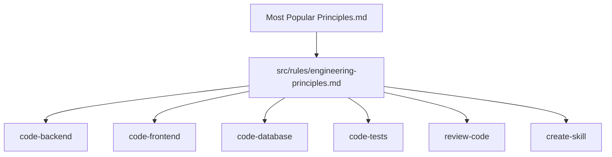

# Technical Specification: Engineering Principles for Agent Instructions

## 1. Overview

### 1.1 Purpose

This spec defines how to integrate common engineering principles into `.agents` as concise runtime guidance, targeted skill behavior, and optional eval coverage.

### 1.2 Background

The source document `Most Popular Principles.md` lists SOLID, DRY, KISS, YAGNI, Law of Demeter, Composition Over Inheritance, Boy Scout Rule, CQS, and Separation of Concerns. It correctly frames these as skills disguised as rules: useful guardrails that require judgment.

The existing `.agents` library already contains overlapping guidance in `karpathy-guidelines`, `code-backend`, `code-frontend`, `review-code`, and `create-skill`. The implementation should therefore avoid duplicating definitions and instead add a small shared rule plus targeted skill patches.

### 1.3 Roles & Responsibilities

|Role / Team|Responsibility|Decision Area|
|---|---|---|
|Owner|Oleg Shulyakov|Scope, naming, final acceptance|
|Skill maintainer|Implement rule and skill updates|File placement, wording, eval coverage|
|Reviewer|Check runtime precision and duplication|Approval or required changes|

### 1.4 Customer & Business Context

Users rely on this skill library to produce code, reviews, docs, and agent artifacts. Better principle integration should make agent behavior simpler, more maintainable, and easier to review without increasing instruction bloat.

### 1.5 Goals

|Goal|Success Metric|Target|
|---|---|---|
|Shared guidance|Global engineering-principles rule exists|1 rule file|
|Targeted behavior|Implementation/review skills apply relevant lenses|4-6 skills updated|
|Concision|Principle definitions are not copied everywhere|No repeated full principle catalog in skills|
|Verification|Markdown and relevant skill validation run|Commands pass or failures documented|

### 1.6 Non-Goals

- Do not create a broad refactor of `.agents`.
- Do not replace `karpathy-guidelines`.
- Do not convert every principle into a mandatory checklist.
- Do not add a standalone skill unless PRD open question Q-1 is resolved differently.

---

## 2. Functional Requirements

### 2.1 Actors

|Actor|Description|
|---|---|
|End user|Requests code, reviews, docs, or skill changes and benefits from improved principle guidance|
|Agent runtime|Loads applicable rules and skills|
|Skill maintainer|Updates `.agents` artifacts and validation coverage|

### 2.2 User Flows

#### Flow: Implement Code With Principle Guidance

1. The user asks for a code change.
2. The relevant build skill applies local architecture first.
3. The agent uses KISS and YAGNI to reject speculative abstractions.
4. The agent uses DRY/SOLID only when they reduce duplicated knowledge, unclear responsibility, coupling, or test risk.
5. The agent verifies the behavior with focused checks.

#### Flow: Review Code With Principle Guidance

1. The user asks for a review.
2. `review-code` inspects changed behavior and nearby contracts.
3. The agent reports only concrete risks, such as duplicated business rules, unclear side effects, over-broad interfaces, leaky dependencies, or brittle abstractions.
4. The agent does not report generic principle violations without a failure mode.

#### Flow: Maintain Skill Quality

1. The user asks to create or update a skill.
2. `create-skill` keeps runtime instructions concise and standalone.
3. The agent avoids unnecessary references, scripts, or layers unless they reduce real complexity or improve validation.

### 2.3 Functional Requirements

#### FR-001: Global Rule File

**Priority:** Must-have
**Actor:** Skill maintainer
**Description:** The system shall define `src/rules/engineering-principles.md` as the concise shared source for applying engineering principles.
**Acceptance criteria:**

- [ ] File includes frontmatter with `name`, `description`, `applies_to`, `priority`, and metadata consistent with existing rules.
- [ ] File starts with one `#` heading.
- [ ] File explains principles as decision lenses, not absolute commands.
- [ ] File covers KISS, YAGNI, DRY, SOLID, Law of Demeter, Composition Over Inheritance, Boy Scout Rule, CQS, and Separation of Concerns.
- [ ] File avoids copying long definitions from the source document.

#### FR-002: Simplicity and Scope Guidance

**Priority:** Must-have
**Actor:** Agent runtime
**Description:** The system shall prefer the smallest complete change that satisfies the user request.
**Acceptance criteria:**

- [ ] Guidance states that KISS and YAGNI are default constraints.
- [ ] Guidance rejects speculative features, unused extension points, single-use abstraction layers, and premature configurability.
- [ ] Guidance scopes cleanup to touched code or code required for the requested change.

#### FR-003: Duplication Guidance

**Priority:** Must-have
**Actor:** Agent runtime
**Description:** The system shall apply DRY to duplicated knowledge or behavior, not harmless textual repetition.
**Acceptance criteria:**

- [ ] Guidance distinguishes duplicated business rules, validation logic, contracts, schemas, and side-effect behavior from repeated markup, fixtures, or simple local setup.
- [ ] Review guidance reports duplication only when it creates a concrete maintenance or behavior risk.

#### FR-004: Responsibility and Dependency Guidance

**Priority:** Must-have
**Actor:** Agent runtime
**Description:** The system shall use SOLID and Separation of Concerns to preserve clear responsibilities and explicit dependencies.
**Acceptance criteria:**

- [ ] Guidance favors cohesive functions, modules, services, components, and skill sections.
- [ ] Guidance keeps interfaces narrow and avoids forcing callers to depend on behavior they do not use.
- [ ] Guidance uses dependency inversion only when the boundary already exists locally or reduces real coupling or test risk.
- [ ] Guidance discourages object chains or module reach-through that expose internal structure.

#### FR-005: Command and Query Guidance

**Priority:** Should-have
**Actor:** Agent runtime
**Description:** The system shall treat CQS as a lens for avoiding surprising side effects.
**Acceptance criteria:**

- [ ] Guidance prefers separating reads from writes when mixed behavior makes code harder to reason about, test, or retry.
- [ ] Guidance allows pragmatic exceptions when local framework conventions combine query and command behavior.

#### FR-006: Implementation Skill Updates

**Priority:** Should-have
**Actor:** Skill maintainer
**Description:** The system shall update selected build skills with targeted principle behavior.
**Acceptance criteria:**

- [ ] `code-backend` preserves or improves its existing pragmatic SOLID guidance without duplicating the new rule.
- [ ] `code-frontend` includes principle guidance only where it affects components, state, effects, or shared abstractions.
- [ ] `code-database` includes principle guidance where it affects schema ownership, duplicated business rules, migrations, and query responsibilities.
- [ ] `code-tests` includes principle guidance where it affects test abstraction, duplicated setup, side effects, and maintainability.

#### FR-007: Review and Skill-Authoring Updates

**Priority:** Should-have
**Actor:** Skill maintainer
**Description:** The system shall update review and skill-authoring workflows with actionable principle lenses.
**Acceptance criteria:**

- [ ] `review-code` can flag over-abstraction, unclear responsibility, leaky dependency chains, duplicated business knowledge, and surprising side effects when tied to concrete risk.
- [ ] `create-skill` preserves standalone behavior while avoiding unnecessary references, scripts, nested workflows, or generic principle boilerplate.

#### FR-008: Eval Coverage

**Priority:** Could-have
**Actor:** Skill maintainer
**Description:** The system should add focused eval prompts for principle integration.
**Acceptance criteria:**

- [ ] At least one eval prompt checks that an implementation skill avoids speculative abstraction.
- [ ] At least one eval prompt checks that review guidance flags duplicated business rules but ignores harmless repeated syntax.
- [ ] Evals are placed with the skill they validate, not in a disconnected global folder.

---

## 3. Non-Functional Requirements

|Category|Requirement|Target|Priority|
|---|---|---|---|
|Token efficiency|Runtime guidance stays concise.|New rule under 200 lines; skill edits surgical.|High|
|Maintainability|Principle behavior has one primary home.|Global rule plus targeted skill specializations.|High|
|Practicality|Guidance produces concrete behavior.|Avoid findings or instructions that only name principles.|High|
|Compatibility|Existing `.agents` structure remains stable.|No skill renames or layout migrations.|High|
|Reviewability|Diff remains focused.|No broad unrelated rewrites.|Medium|

---

## 4. System Architecture

### 4.1 Architecture Overview

The integration uses a layered documentation model:

The source document remains the collected reference. The new rule becomes the runtime baseline. Individual skills receive only the minimum additional wording needed to translate the shared principle into their domain.

### 4.2 Component Responsibilities

|Component|Technology|Responsibility|
|---|---|---|
|Source principles doc|Markdown|Preserve the collected principle list and framing.|
|Engineering principles rule|Markdown rule|Define concise runtime guidance for applying principles pragmatically.|
|Build skills|Markdown skills|Apply principle lenses during implementation.|
|Review skill|Markdown skill and references|Apply principle lenses only when tied to concrete review findings.|
|Create-skill workflow|Markdown skill and references|Keep skill artifacts cohesive, standalone, and minimal.|
|Evals|JSON prompts|Validate selected trigger and behavior expectations.|

### 4.3 Key Design Decisions

#### Decision: Start With a Rule, Not a Skill

- **Chosen:** Add `src/rules/engineering-principles.md`.
- **Rationale:** The principles should influence many tasks without requiring a user to ask for an explicit skill.
- **Trade-off:** The rule cannot provide deep teaching examples. Those can remain in docs or later references.

#### Decision: Patch Selected Skills Only

- **Chosen:** Update implementation, review, and skill-authoring skills where behavior changes.
- **Rationale:** Broad edits would increase runtime noise and make the integration harder to review.
- **Trade-off:** Some skills will rely only on the global rule.

#### Decision: Treat Principles as Lenses

- **Chosen:** Require concrete behavior, tradeoff, or failure mode before applying a principle.
- **Rationale:** Mechanical principle enforcement causes over-engineering.
- **Trade-off:** This depends on agent judgment, so evals should cover common failure modes.

---

## 5. API Design

No external API changes are required.

---

## 6. Data Model

No persistence or schema changes are required.

---

## 7. Security Considerations

No new runtime security surface is introduced. Skill and rule edits must not instruct agents to expose secrets, broaden filesystem access, bypass approvals, or perform unrequested network actions.

---

## 8. Observability

No production observability changes are required. Development-time validation should rely on Markdown linting, skill validation scripts, and focused eval prompts where added.

---

## 9. Testing Strategy

|Level|Scope|Tools|Coverage Target|
|---|---|---|---|
|Markdown lint|Changed Markdown files|`markdownlint` or `markdownlint-cli2`|No lint errors, unless documented|
|Skill validation|Changed skills|`src/skills/create-skill/scripts/validate.py`|Pass for every changed skill|
|Eval prompts|Principle-specific behavior|Existing skill eval workflow|Added only where behavior risk justifies it|
|Manual review|Runtime wording|Human review|No duplicated full principle catalog or vague principle boilerplate|

### 9.1 Data, Privacy, and Compliance Verification

No personal data handling changes are expected. Verify that new wording does not encourage storing sensitive information in memory, logs, docs, or generated examples.

---

## 10. Implementation Plan

### Phase 1: Documentation Baseline

- [x] Create `docs/2026-05-23-design-principles/PRD.md`.
- [x] Create `docs/2026-05-23-design-principles/SPEC.md`.
- [ ] Review open questions before implementation.

### Phase 2: Global Rule

- [ ] Add `src/rules/engineering-principles.md`.
- [ ] Keep rule concise and consistent with existing rule metadata.
- [ ] Cross-check overlap with `src/rules/karpathy-guidelines.md`.

### Phase 3: Targeted Skill Updates

- [ ] Patch `code-backend` only if the new rule clarifies or replaces current principle wording.
- [ ] Patch `code-frontend` for component/state/effect abstraction guidance.
- [ ] Patch `code-database` for schema/query/rule ownership guidance.
- [ ] Patch `code-tests` for test abstraction and setup duplication guidance.
- [ ] Patch `review-code` for actionable principle-based finding criteria.
- [ ] Patch `create-skill` for skill artifact cohesion and anti-boilerplate guidance.

### Phase 4: Verification

- [ ] Run Markdown lint on changed Markdown files.
- [ ] Run quick validation for changed skills.
- [ ] Add and run focused evals if implementation changes behavior enough to justify them.
- [ ] Record failures or skipped checks in the final handoff.

### Dependencies

|Dependency|Team / System|Needed by|
|---|---|---|
|Source principles document|Docs|Phase 2|
|Existing rule and skill metadata conventions|`.agents`|Phase 2 and Phase 3|
|Skill validation script|`create-skill`|Phase 4|

---

## 11. Release & Operational Readiness

|Activity|Owner|Required Before Launch|
|---|---|---|
|Rule reviewed for duplication with existing guidance|Oleg Shulyakov|Yes|
|Skill edits reviewed for runtime bloat|Oleg Shulyakov|Yes|
|Markdown lint run|TBD|Yes|
|Skill validation run for changed skills|TBD|Yes|
|Evals added or deferred with rationale|TBD|No|

---

## 12. Open Questions

|#|Question|Owner|Due|Status|
|---|---|---|---|---|
|1|Should implementation include eval prompts in the first pass?|Oleg Shulyakov|TBD|Open|
|2|Should `karpathy-guidelines` remain separate from `engineering-principles`, or should overlapping simplicity guidance be merged later?|Oleg Shulyakov|TBD|Open|
|3|Should `Most Popular Principles.md` be renamed to fix `principals`/`principles` wording in its body?|Oleg Shulyakov|TBD|Open|

---
