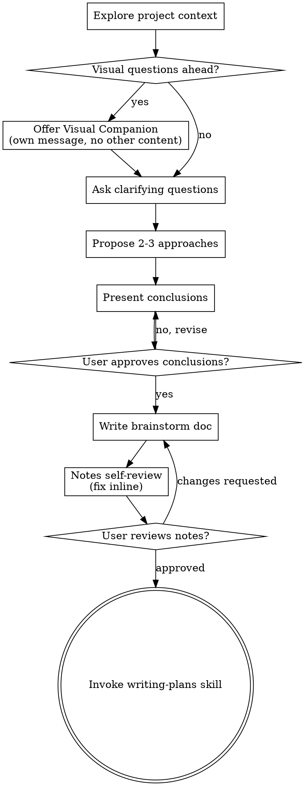

# Brainstorming Ideas

Help explore ideas, compare alternatives, and capture conclusions through natural collaborative dialogue.

Start by understanding the current project context, then ask questions one at a time to refine the idea. Once the topic is clear, present the conclusions and get user approval.

## Anti-Pattern: "This Is Too Simple To Brainstorm"

Every project goes through this process. A todo list, a single-function utility, a config change — all of them. "Simple" projects are where unexamined assumptions cause the most wasted work. The conclusions can be short (a few sentences for truly simple projects), but you MUST present them and get approval.

## Checklist

You MUST create a task for each of these items and complete them in order:

1. **Explore project context** — check files, docs, recent commits
2. **Offer visual companion** (if topic will involve visual questions) — this is its own message, not combined with a clarifying question. See the Visual Companion section below.
3. **Ask clarifying questions** — one at a time, understand purpose/constraints/success criteria
4. **Propose 2-3 approaches** — with trade-offs and your recommendation
5. **Present conclusions** — summarize the explored ideas and emerging decisions, then get user approval
6. **Write brainstorm doc** — save to `docs/YYYY-MM-DD-[topic]/BRAINSTORM.md`
7. **Notes self-review** — quick inline check for placeholders, contradictions, ambiguity, scope (see below)
8. **User reviews written notes** — ask user to review the brainstorm file before proceeding
9. **Transition to implementation** — create an implementation plan

## Process Flow



**The terminal state is creating an implementation plan.** Do not start implementation from brainstorming; first turn the approved conclusions into a concrete plan.

## The Process

**Understanding the idea:**

- Check out the current project state first (files, docs, recent commits)
- Before asking detailed questions, assess scope: if the request describes multiple independent subsystems (e.g., "build a platform with chat, file storage, billing, and analytics"), flag this immediately. Don't spend questions refining details of a project that needs to be decomposed first.
- If the project is too large for one focused brainstorm, help the user decompose it into sub-projects: what are the independent pieces, how do they relate, and what order should they be explored? Then brainstorm the first sub-project through the normal flow. Each sub-project gets its own brainstorm → plan → implementation cycle.
- For appropriately-scoped projects, ask questions one at a time to refine the idea
- Prefer multiple choice questions when possible, but open-ended is fine too
- Only one question per message - if a topic needs more exploration, break it into multiple questions
- Focus on understanding: purpose, constraints, success criteria

**Exploring approaches:**

- Propose 2-3 different approaches with trade-offs
- Present options conversationally with your recommendation and reasoning
- Lead with your recommended option and explain why

**Presenting conclusions:**

- Once you understand the topic, summarize the goal, ideas considered, trade-offs, and emerging decisions
- Scale the summary to the topic: a few sentences if straightforward, up to 200-300 words if nuanced
- Ask whether the conclusions look right before writing the brainstorm document
- Keep technical design details out unless they are necessary to explain an idea or decision
- Be ready to go back and clarify if something doesn't make sense

**Design for isolation and clarity:**

- Break the system into smaller units that each have one clear purpose, communicate through well-defined interfaces, and can be understood and tested independently
- For each unit, you should be able to answer: what does it do, how do you use it, and what does it depend on?
- Can someone understand what a unit does without reading its internals? Can you change the internals without breaking consumers? If not, the boundaries need work.
- Smaller, well-bounded units are also easier for you to work with - you reason better about code you can hold in context at once, and your edits are more reliable when files are focused. When a file grows large, that's often a signal that it's doing too much.

**Working in existing codebases:**

- Explore the current structure before proposing changes. Follow existing patterns.
- Where existing code has problems that affect the work (e.g., a file that's grown too large, unclear boundaries, tangled responsibilities), include targeted improvements as part of the design - the way a good developer improves code they're working in.
- Don't propose unrelated refactoring. Stay focused on what serves the current goal.

## After the Brainstorm

**Documentation:**

- Write the validated brainstorm notes to `docs/YYYY-MM-DD-[topic]/BRAINSTORM.md`
  - (User preferences for document location override this default)
- Use this general structure, adapting headings to the topic while preserving the frontmatter fields:

```markdown
---
topic: [Topic]
method: [Method]
date: "YYYY-MM-DD"
related:
  - [Optional path, issue, or URL]
---

# Brainstorm - [Topic]

## Goal

## Context

## Agenda

1. ...

## Ideas Considered

### [Idea]

- **Description:** ...
- **Benefits:** ...
- **Trade-offs:** ...

## Outcomes

### Summary

### Decisions

### Open Questions

## Next Steps
```

- Omit `related` when there are no useful references
- Use a concise method name that describes how ideas were explored, such as `comparative analysis`, `creative matrix`, `round robin`, or `idea prioritization`
- Record substantive discussion in the body; frontmatter is only for document metadata
- Capture general discovery and decisions, not a technical design or implementation specification

**Notes Self-Review:**
After writing the brainstorm document, look at it with fresh eyes:

1. **Placeholder scan:** Any "TBD", "TODO", incomplete sections, or vague requirements? Fix them.
2. **Internal consistency:** Do any sections contradict each other? Do the decisions follow from the ideas and trade-offs?
3. **Scope check:** Is this focused enough for a single implementation plan, or does it need decomposition?
4. **Ambiguity check:** Could any requirement be interpreted two different ways? If so, pick one and make it explicit.

Fix any issues inline. No need to re-review — just fix and move on.

**User Review Gate:**
After the notes review loop passes, ask the user to review the written brainstorm document before proceeding:

"Brainstorm notes written to `[path]`. Please review them and let me know if you want to make any changes before we start writing the implementation plan."

Wait for the user's response. If they request changes, make them and re-run the notes review loop. Only proceed once the user approves.

**Implementation:**

- Create a detailed implementation plan from the approved brainstorm conclusions

## Key Principles

- **One question at a time** - Don't overwhelm with multiple questions
- **Multiple choice preferred** - Easier to answer than open-ended when possible
- **YAGNI ruthlessly** - Remove unnecessary features from all proposals
- **Explore alternatives** - Always propose 2-3 approaches before settling
- **Incremental validation** - Present conclusions and get approval before moving on
- **Be flexible** - Go back and clarify when something doesn't make sense

## Visual Companion

A browser-based companion for showing mockups, diagrams, and visual options during brainstorming. Available as a tool — not a mode. Accepting the companion means it's available for questions that benefit from visual treatment; it does NOT mean every question goes through the browser.

**Offering the companion:** When you anticipate that upcoming questions will involve visual content (mockups, layouts, diagrams), offer it once for consent:
> "Some of what we're working on might be easier to explain if I can show it to you in a web browser. I can put together mockups, diagrams, comparisons, and other visuals as we go. This feature is still new and can be token-intensive. Want to try it? (Requires opening a local URL)"

**This offer MUST be its own message.** Do not combine it with clarifying questions, context summaries, or any other content. The message should contain ONLY the offer above and nothing else. Wait for the user's response before continuing. If they decline, proceed with text-only brainstorming.

**Per-question decision:** Even after the user accepts, decide FOR EACH QUESTION whether to use the browser or the terminal. The test: **would the user understand this better by seeing it than reading it?**

- **Use the browser** for content that IS visual — mockups, wireframes, layout comparisons, architecture diagrams, side-by-side visual designs
- **Use the terminal** for content that is text — requirements questions, conceptual choices, tradeoff lists, A/B/C/D text options, scope decisions

A question about a UI topic is not automatically a visual question. "What does personality mean in this context?" is a conceptual question — use the terminal. "Which wizard layout works better?" is a visual question — use the browser.
